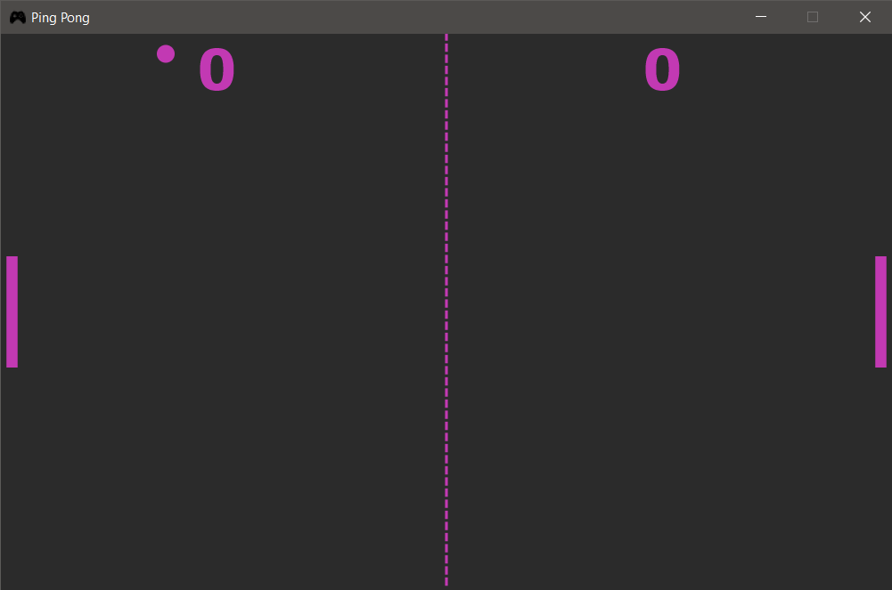

# Ping-Pong

## Synopsis

Ping-Pong, is a game in which two or four players hit a little, light ball back and forth across a table using a small 
paddle. A point is scored when a player fails to return the ball to the other player.

## Table of Contents

> * [Title](#ping-pong)
>   * [Synopsis](#synopsis)
>   * [Table of Contents](#table-of-contents)
>   * [Dependencies](#dependencies)
>   * [Installation Guide](#installation-guide)
>   * [Usage](#usage)

## Dependencies

- JavaFX SDK 11.0.2+

## Installation Guide

This project is built using *IntelliJ IDEA 2020.2.3* and *java version 16.0.1*. Hence, the following steps are according
to it. If the reader is using any other IDE, an updated version of IntelliJ IDEA or has java version less than 11, then
he/she has to do the required configuration listed below by themselves.

1. Install [JavaFX SDK](https://www.oracle.com/java/technologies/install-javafx-sdk.html) library
2. Add the JavaFX SDK to the project library. 

   * From the main menu, select **File | Project Structure**.   
   * Open the **Libraries** section, click the **+**, and select **Java**.
   * Specify the path to the **lib** folder in the JavaFX SDK package, for example: **/Users/jetbrains/javafx-sdk-12/lib**.
   * Apply the changes and close the **Project Structure** dialog.
   
3. Add VM Options. _(This step may not be necessary depending upon the IDE and java version)_.
    
   * From the main menu, select **Run | Edit Configurations**.
   * Select **Application | Main** from the list on the left.
   * In the **VM options** field, specify the following options, but make sure to replace `/path/to/javafx/sdk` with 
     the path the **lib** directory of the downloaded JavaFX SDK distribution.
     
     `--module-path /path/to/javafx/sdk --add-modules javafx.controls,javafx.fxml`
     
     If your path contains spaces, wrap it in double quotes, for example: **"/Users/jetbrains/My Folder/javafx-sdk-12/lib"**.

   * Apply the change and close the dialog.

## Usage

A [demo video](Demo.mp4) is uploaded along with the source code to make the working of the project clear. Here are the
steps:   

###### Running the application

[Play.java](src/Play.java) contains the `main` method of the project. Run the project.

###### Controls

The left paddle is the user paddle and can be controlled using `Up` and `Down` arrow keys. 